# ProgressIndicators
Material Progress Indicators reserves code for instant usage of progress indicators using *material design 3* specifications in openHarmony.

## Dependencies
Add the below dependency in entry/package.json for using ProgressIndicators
```
"dependencies": {
"@ohos/materialprogressbar": "file:../materialprogressbar"
}
```

## Implementation 
The location to the source code is - MaterialProgressBar/src/main/ets/components/basic

The implementation starts with the setting the progress and the max progress.


Then the 'LinearPath' and 'CircularPath' files are built separately and the 'LinearComponent' and 'CircularComponent' files are built on top of them respectively.

The 'MaterialComponents' file in the main file in the directory that uses all the other files build the struct there along with some default parameters.
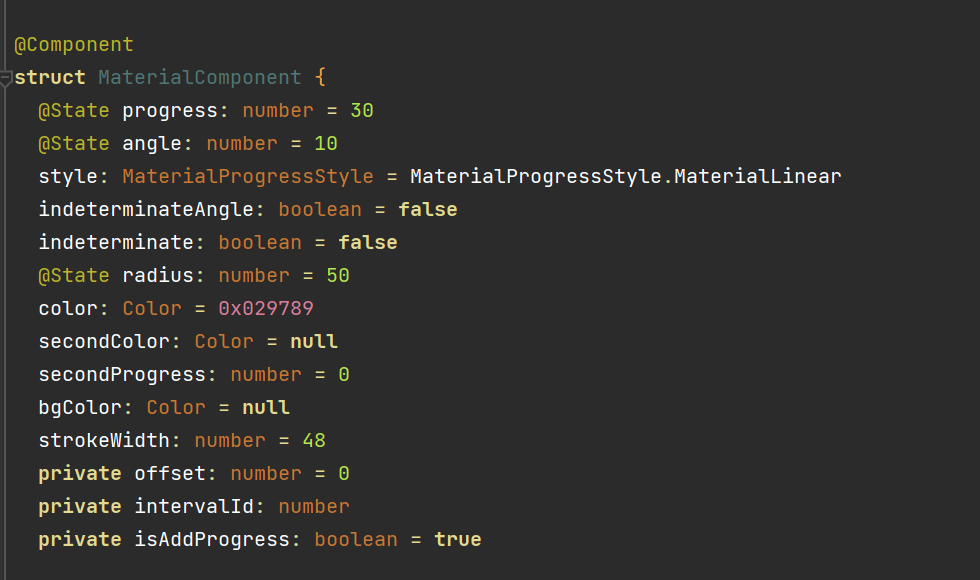

The 'MaterialProgressBar' takes the input from the user and set the parameters.

## Importing
To use the ProgressIndicators, the components can be imported at once.
```ets
import { MaterialProgressBar, MaterialProgressStyle } from "@ohos/materialprogressbar"
```

## Usage and Variations
Material Progress Indicators provide majorly four kind of indicators which are as follows:
### Linear Determinate Progress Indicator
#### Implementing for usage
To use an instance of Linear Determinate Progress Indicator, the 'indeterminate' and 'indeterminateAngle' parameters need to be turned to 'false' in the 'MaterialHorizontal' component.
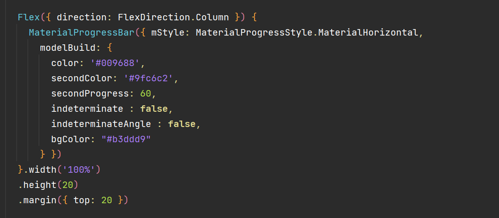

#### Instance
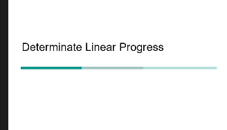

### Linear Indeterminate Progress Indicator
#### Implementing for usage
To use an instance of Linear Determinate Progress Indicator, the 'indeterminate' and 'indeterminateAngle' parameters need to be turned to 'true' in the 'MaterialHorizontal' component.
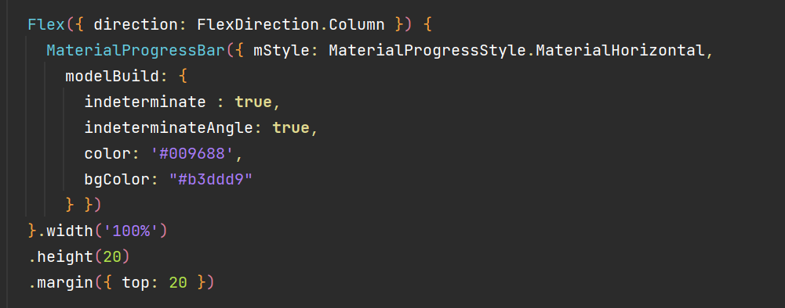

#### Instance
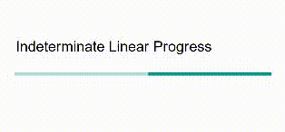

### Circular Determinate Progress Indicator
#### Implementing for usage
To use an instance of Linear Determinate Progress Indicator, the 'indeterminate' and 'indeterminateAngle' parameters need to be turned to 'false' in the 'MaterialCircular' component.
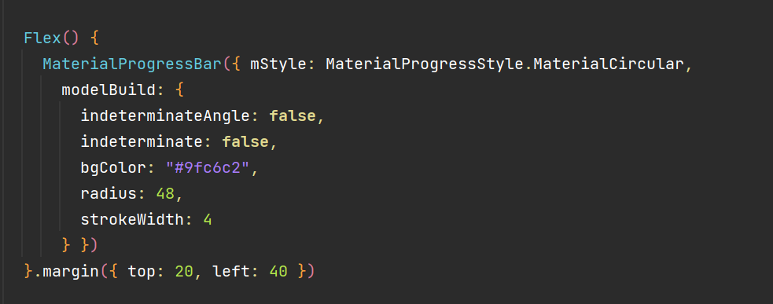

#### Instance
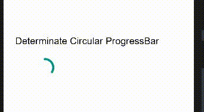

### Circular Indeterminate Progress Indicator
#### Implementing for usage
To use an instance of Linear Determinate Progress Indicator, the 'indeterminate' and 'indeterminateAngle' parameters need to be turned to 'true' in the 'MaterialCircular' component.
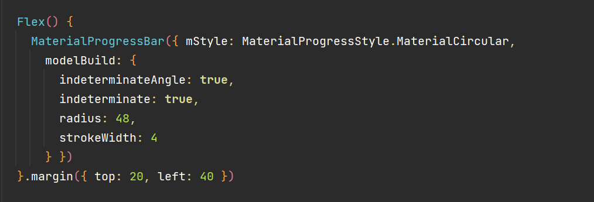

#### Instance
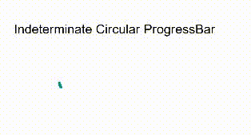

## Features
The Progress Indicators are deployed with the following features - 
* Linear and Circular type of indicators
* Determinate and Indeterminate classes
* Customized colors
* Customized size and strokewidth(for circular ones)

Some examples of the Progress Indicators handy to use are mentioned below.
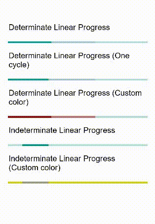
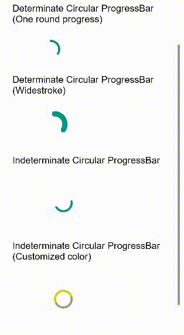

## Compatibility
Supports OpenHarmony API version 8

## Code Contribution
If you find any problems during usage, you can raise an Issue.
